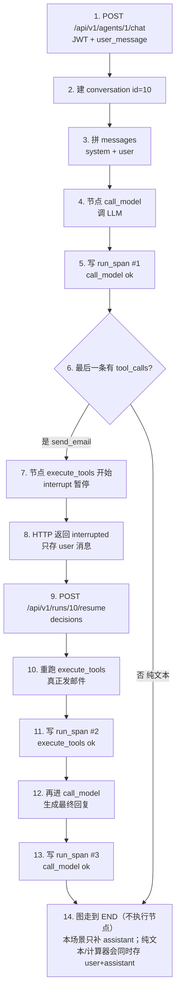

# R2 一次执行：每个节点改了什么数据

| 项目 | 内容 |
| --- | --- |
| 版本 | V2.1 |
| 日期 | 2026-08-28 |
| 场景 | 新建会话 → 用户说「请发邮件给老板」→ HITL 暂停 → 批准 → 最终回复 |
| 假定 | Mock provider、已登录、Agent `id=1`、新会话将得到 `conversation_id=10` |

只看本文即可。走的是生产路径 `StateGraph`（不是 `run_loop`）。计算器路径在文末对照：没有 `interrupt`，`execute_tools` 一次跑完。

`aget_state` / checkpoint 各字段见 [13-R2_Langgraph_Snapshot.md](13-R2_Langgraph_Snapshot.md)。概念与问答见 [11-R2_Langgraph_Runtime.md](11-R2_Langgraph_Runtime.md)。

---

## 0. HTTP 当场 + 三份落库（全程都会碰到）

同一轮 Chat 会碰到 **HTTP 当场** 和 **三处落库**。后面每一步会标明改的是哪一处。

```text
┌─ HTTP ─────────────────────────────────────────────┐
│ 请求 / 响应体只活在这一次调用里。会话行在步骤 2 写入 conversation 表 │
└────────────────────────────────────────────────────┘
┌─ 表 conversation_message ── 给人看的历史 ───────────┐
│ role + content。HITL 暂停时只有 user；完成后再补 assistant │
└────────────────────────────────────────────────────┘
┌─ LangGraph checkpoint ── 图自己的存档 ──────────────┐
│ messages（含 tool）+ iteration；snapshot 上还能看到 next / interrupts │
│ 杀进程也能 resume。thread_id = "10"（会话 id）         │
└────────────────────────────────────────────────────┘
┌─ 表 run_span ── 节点耗时 ───────────────────────────┐
│ 每成功结束一个图节点一条。interrupt 中断的节点不写      │
└────────────────────────────────────────────────────┘
```

### 贯穿全程的类型

**图状态 `AgentGraphState`**

```python
{
  "messages": [AIMessage, ...],   # 用 add 追加，不会覆盖旧列表
  "iteration": int,               # 每进一次 call_model +1；新一轮 Chat 会写成 0，上限 5 只约束这一次 ainvoke。resume 不重置
}
```

**`AIMessage`**

```python
{
  "role": "system" | "user" | "assistant" | "tool",
  "content": str | None,
  "tool_calls": list[dict] | None,      # 仅 assistant 调工具时
  "tool_call_id": str | None,           # 仅 role=tool，对上某次 call
}
```

assistant 的 `tool_calls` 一项（OpenAI 形态）：

```python
{
  "id": "call_send_email_1",
  "function": {
    "name": "send_email",
    "arguments": '{"to":"ops@eaap.com","subject":"...","body":"..."}',
  },
}
```

**Chat 进出**

```python
# 请求
{ "conversation_id": null, "user_message": "请发邮件给老板", "variables": null }

# 完成
{
  "conversation_id": 10,
  "role": "assistant",
  "content": "已发送 to=ops@eaap.com ...",
  "created_at": "2026-08-28T12:00:00+00:00",
  "status": "completed",
  "pending": null,
}

# 暂停
{
  "conversation_id": 10,
  "role": "assistant",
  "content": null,
  "created_at": null,
  "status": "interrupted",
  "pending": {
    "pending": [
      {
        "id": "call_send_email_1",
        "name": "send_email",
        "arguments": { "to": "ops@eaap.com", "subject": "...", "body": "..." },
      }
    ]
  },
}
```

**`run_span` 一行**

```python
{
  "id": 1,
  "conversation_id": 10,
  "node": "call_model",          # 或 execute_tools
  "started_at": "...",
  "duration_ms": 12,
  "tool_name": None,             # call_model 为 null；工具节点为 "send_email"
  "status": "ok",                # 或 error
  "error": None,
}
```

**checkpoint 快照**（`aget_state`）代码里用三个字段。  
`ainvoke(payload)` 一进来就会按这次 input **先写一条** checkpoint（`metadata.source` 常是 `input`，`step` 常是 `-1`）。所以第一个 super-step **开始前**已经有 checkpoint 了，节点是在这条之上跑的。每个 super-step **结束后**再写下一条（`source=loop`）。一步里多个并行节点要全部跑完才进入下一步；有依赖就不要放进同一步。`interrupt()` 暂停时也会存。`END` 不是可执行节点：最后一次真实节点（如 `call_model`）结束时写下的那条已经是 `next=()`，循环发现没有 task 就退出，**不会再为 END 写一条**。

```python
snapshot.values      # {"messages": [...], "iteration": n}；从未跑过是 {}（无 checkpoint 的占位）
snapshot.next        # 有存档时 () = 已结束；("execute_tools",) = 还要跑这个节点。从未跑过的 () 只是占位
snapshot.interrupts  # () 或 (Interrupt(id=框架id, value=上面 pending),)
```
详细的字段参考：[13-R2_Langgraph_Snapshot.md](13-R2_Langgraph_Snapshot.md)
---

## 1. 总流程（先看图，再按步对照数据）



纯文本在第 6 步走「否」，没有 7–13（不会进 `execute_tools`，也没有第二趟 `call_model`）。计算器在第 6 步有工具但是 **不 interrupt**，7 和 10 合成一次 `execute_tools`，没有 8–9。

---

## 2. 逐步：做什么、改哪份数据、长什么样

### 步骤 1 — HTTP 入口

**做什么：** 校验 Bearer JWT，按 `created_by` 取 Agent `id=1`。`conversation_id` 为 null。

**数据：** 尚未写库。请求体：

```json
{
  "conversation_id": null,
  "user_message": "请发邮件给老板",
  "variables": null
}
```

---

### 步骤 2 — 新建会话

**做什么：** `ConversationService` 插入一行会话，名字常用首条用户消息。

**创建 `conversation`：**

```json
{
  "id": 10,
  "name": "请发邮件给老板",
  "user_id": 1,
  "agent_id": 1
}
```

此后图的 `thread_id = "10"`。`conversation_message` 此时还是空的（user 要等图跑完或暂停后再存）。

---

### 步骤 3 — 拼本轮输入（还不进图）

**做什么：** `PromptManager` 取最新 Prompt 或 `agent.system_prompt`；`MemoryManager` 取近 10 条（新会话为空）；末尾加上本轮 user。

```json
[
  { "role": "system", "content": "You are a helpful agent.", "tool_calls": null, "tool_call_id": null },
  { "role": "user", "content": "请发邮件给老板"}
]
```
`_input_for_turn` 里的 `aget_state`：新 thread **还没有 checkpoint**，拿到的是占位 Snapshot（`values {}`、`next ()`、`metadata None`）。因此会把上面 **整段**（含 system）作为图输入，并带上 `iteration: 0`。若已经有真实 checkpoint 且里面有 `messages`（同一会话再发一轮 Chat），则 input 的 `messages` 只放本轮 user，不再把 Memory 历史喂进去（如下）。`iteration: 0` 没有 reducer，新一轮 Chat 会覆盖旧值；**resume 不走这里**，不会把 `iteration` 打回 0。

`ainvoke` **开始之后**才会写入 input checkpoint（`source=input`，`next` 一般是 `("__start__",)` 或 `call_model`），和上面这个占位快照不是同一时刻。

```json
[ 
  { "role": "user", "content": "请发邮件给老板"}
]
```
调用如下：
```python
graph.ainvoke({"messages": messages, "iteration": 0})
```
LangGraph 收到一次新的 input 后，会先写一条初始 checkpoint（`metadata.source` 常是 `input`，`step` 常是 `-1`）。

下面这段 **不是本仓库的图**（官方示例用 `foo` / `bar` / `node_a`，你们是 `messages` / `iteration`）。它是 `aget_state_history` 的形态：**列表第 0 条是最新**，最后一条才是刚收到 input 时那条。`aget_state` 一次只返回最新那一条。字段含义见 [13-R2_Langgraph_Snapshot.md](13-R2_Langgraph_Snapshot.md)。

```json
[
    StateSnapshot(
        values={'foo': 'b', 'bar': ['a', 'b']},
        next=(),
        config={'configurable': {'thread_id': '1', 'checkpoint_ns': '', 'checkpoint_id': '1ef663ba-28fe-6528-8002-5a559208592c'}},
        metadata={'source': 'loop', 'writes': {'node_b': {'foo': 'b', 'bar': ['b']}}, 'step': 2},
        created_at='2024-08-29T19:19:38.821749+00:00',
        parent_config={'configurable': {'thread_id': '1', 'checkpoint_ns': '', 'checkpoint_id': '1ef663ba-28f9-6ec4-8001-31981c2c39f8'}},
        tasks=(),
    ),
    StateSnapshot(
        values={'foo': 'a', 'bar': ['a']},
        next=('node_b',),
        config={'configurable': {'thread_id': '1', 'checkpoint_ns': '', 'checkpoint_id': '1ef663ba-28f9-6ec4-8001-31981c2c39f8'}},
        metadata={'source': 'loop', 'writes': {'node_a': {'foo': 'a', 'bar': ['a']}}, 'step': 1},
        created_at='2024-08-29T19:19:38.819946+00:00',
        parent_config={'configurable': {'thread_id': '1', 'checkpoint_ns': '', 'checkpoint_id': '1ef663ba-28f4-6b4a-8000-ca575a13d36a'}},
        tasks=(PregelTask(id='6fb7314f-f114-5413-a1f3-d37dfe98ff44', name='node_b', error=None, interrupts=()),),
    ),
    StateSnapshot(
        values={'foo': '', 'bar': []},
        next=('node_a',),
        config={'configurable': {'thread_id': '1', 'checkpoint_ns': '', 'checkpoint_id': '1ef663ba-28f4-6b4a-8000-ca575a13d36a'}},
        metadata={'source': 'loop', 'writes': None, 'step': 0},
        created_at='2024-08-29T19:19:38.817813+00:00',
        parent_config={'configurable': {'thread_id': '1', 'checkpoint_ns': '', 'checkpoint_id': '1ef663ba-28f0-6c66-bfff-6723431e8481'}},
        tasks=(PregelTask(id='f1b14528-5ee5-579c-949b-23ef9bfbed58', name='node_a', error=None, interrupts=()),),
    ),
    StateSnapshot(
        values={'bar': []},
        next=('__start__',),
        config={'configurable': {'thread_id': '1', 'checkpoint_ns': '', 'checkpoint_id': '1ef663ba-28f0-6c66-bfff-6723431e8481'}},
        metadata={'source': 'input', 'writes': {'foo': ''}, 'step': -1},
        created_at='2024-08-29T19:19:38.816205+00:00',
        parent_config=None,
        tasks=(PregelTask(id='6d27aa2e-d72b-5504-a36f-8620e54a76dd', name='__start__', error=None, interrupts=()),),
    )
]
```
---

### 步骤 4 — 节点 `call_model`（第一趟）

**做什么：** `iteration = 0 + 1 → 1`。`LLMGateway.chat(provider, model, messages, tools=全部工具 schema)`。Mock 看出要发邮件，返回带 `tool_calls` 的 assistant，**不**走 `parse_final_answer`，也 **不** 切 token。

`call_model`节点执行完更新AgentGraphState和checkpoint

**checkpoint `values` 追加（operator.add）：**

```json
{
  "messages": [
    { "role": "system", "content": "You are a helpful agent." },
    { "role": "user", "content": "请发邮件给老板" },
    {
      "role": "assistant",
      "content": null,
      "tool_calls": [
        {
          "id": "call_send_email_1",
          "function": {
            "name": "send_email",
            "arguments": "{\"to\":\"ops@eaap.com\",\"subject\":\"请发邮件给老板\",\"body\":\"请发邮件给老板\"}"
          }
        }
      ]
    }
  ],
  "iteration": 1
}
```

节点正常 return → 会写 span（下一步）。邮件 **还没发**。

---

### 步骤 5 — 写 `run_span` #1

**做什么：** `_node_span("call_model")` 的 `else`：成功结束，落库。

**创建：**

```json
{
  "id": 1,
  "conversation_id": 10,
  "node": "call_model",
  "started_at": "2026-08-28T12:00:00+00:00",
  "duration_ms": 15,
  "tool_name": null,
  "status": "ok",
  "error": null
}
```

---

### 步骤 6 — 条件边 `_route`

**做什么：** 看 `messages[-1]`。有 `tool_calls` → 去 `execute_tools`。无 → `END`（纯文本走这里，跳到步骤 14，且不会有工具 span）。

不写库。不改 `iteration`。

---

### 步骤 7 — 节点 `execute_tools` 第一次（暂停）

**做什么：**

1. 从 last assistant 取出 `calls`。
2. `_approval_payload`：将requires_approval=True的工具组成 `pending`。
3. `_emit(("interrupt", pending))`（SSE 时推一帧；非流式被吃掉）。
4. `interrupt(pending)` **第一次**：节点里抛 `GraphInterrupt`（`GraphBubbleUp` 子类），节点 **没有 return**。运行时接住异常并暂停；`ainvoke` 对 Executor **正常返回**（带 `__interrupt__`），不是把异常抛到 HTTP 层。
5. `_node_span` 捕获的是 `GraphBubbleUp` → **不写** `execute_tools` 的 span；只有普通异常和成功 return 才写 span。

节点没 return，所以这一步没有新的 `messages` 写入（仍是步骤 4 的 values）。checkpoint **还是会存**，用来记下 `next=("execute_tools",)` 和 `interrupts`。 

**checkpoint 变成：**

```text
values:     与步骤 4 相同（仍无 role=tool 的消息）
next:       ("execute_tools",)
interrupts: (
  Interrupt(
    id: "aef2b739fd90b2d8...",          # 框架生成的 Interrupt.id；pending≥2 时按它点名 resume，不是 resume 列表下标，也不是 call_send_email_1
    value: {                            # = interrupt() 的入参
      "pending": [
        {
          "id": "call_send_email_1",
          "name": "send_email",
          "arguments": {
            "to": "ops@eaap.com",
            "subject": "请发邮件给老板",
            "body": "请发邮件给老板"
          }
        }
      ]
    }
  ),
)
```
本步暂停时 `ainvoke` 对调用方正常返回 dict（不是 raise 到 HTTP），另带 `__interrupt__`：

```python
{
  "messages": [...],   # 停住时已有的消息（含带 tool_calls 的 assistant）
  "iteration": 1,
  "__interrupt__": (
    Interrupt(value={"pending": [{"id", "name", "arguments"}, ...]}, id="..."),
  ),
}
```
注意：__interrupt__ 不是 AgentGraphState 里的字段，只出现在 ainvoke 的返回值里。

Executor 据此得到 `GraphRunResult(status="interrupted", pending=value)`。

---

### 步骤 8 — 第一次 HTTP 返回，只存 user

**做什么：** 不存 assistant。`create_user_message`。

**创建 `conversation_message`：**

```json
{
  "id": 101,
  "conversation_id": 10,
  "role": "user",
  "content": "请发邮件给老板"
}
```

**HTTP 响应：**

```json
{
  "conversation_id": 10,
  "role": "assistant",
  "content": null,
  "created_at": null,
  "status": "interrupted",
  "pending": {
    "pending": [
      {
        "id": "call_send_email_1",
        "name": "send_email",
        "arguments": { "to": "ops@eaap.com", "subject": "请发邮件给老板", "body": "请发邮件给老板" }
      }
    ]
  }
}
```

此时三份落库对照：

| 位置 | 内容 |
| --- | --- |
| 对话表 | 仅 user |
| checkpoint | user + assistant(tool_calls)；`next=execute_tools`；有 interrupts |
| run_span | 仅 #1 `call_model` |

`GET /api/v1/runs/10` → `{ "run_id": "10", "status": "interrupted", "pending": { 同上 } }`。  
再 `POST /api/v1/agents/1/chat` 同一会话会被 `_reject_if_paused` 拦：`snapshot.next` 非空。

---

### 步骤 9 — `POST /runs/10/resume`

**请求：**

```json
{
  "decisions": [
    { "id": "call_send_email_1", "approved": true }
  ]
}
```

**做什么：** `aget_state` 确认 `next` 非空；用 `interrupts[0].value` 核对每个 pending id 都有选择；然后

```python
ainvoke(Command(resume={"decisions": {"call_send_email_1": True}}), config)
```

checkpoint 里这份 task 的 **resume 列表** 变为长度 1（按下标对齐这一次 `interrupt()` 调用，不是按邮件 id 查）。不写 `conversation_message`。

---

### 步骤 10 — 重跑整个 `execute_tools`

**做什么：** 节点从第一行再来。`pending` 仍算得出来。再次碰到 `interrupt(pending)`：**有 resume 值，直接返回** `{"decisions": {"call_send_email_1": True}}`，不再抛错。然后 `send_email.execute(...)`，邮件真正发出。

**checkpoint `values.messages` 再追加一条 tool：**

```json
{
  "role": "tool",
  "content": "已发送 to=ops@eaap.com subject=请发邮件给老板",
  "tool_call_id": "call_send_email_1",
  "tool_calls": null
}
```

（若 `approved: false`，content 为 `"user denied"`，工具不执行。）

`next` 在节点成功结束后变为要跑 `call_model`（边上写死了 `execute_tools → call_model`）。`interrupts` 清空。

SSE 若在流：会 `_emit` tool start / result（resume 当前是非流式，这些 emit 被吃掉）。

---

### 步骤 11 — 写 `run_span` #2

节点这次 **正常 return**，不再是 GraphBubbleUp。

```json
{
  "id": 2,
  "conversation_id": 10,
  "node": "execute_tools",
  "started_at": "2026-08-28T12:00:20+00:00",
  "duration_ms": 8,
  "tool_name": "send_email",
  "status": "ok",
  "error": null
}
```

---

### 步骤 12 — 节点 `call_model`（第二趟）

**做什么：** `iteration = 1 + 1 → 2`。把含 tool 结果的 messages 再送给模型。Mock 返回最终中文，无 `tool_calls`。走 `parse_final_answer`（散文则原样）。非流式无 token 帧。

**checkpoint 再追加：**

```json
{
  "role": "assistant",
  "content": "已发送 to=ops@eaap.com subject=请发邮件给老板",
  "tool_calls": null,
  "tool_call_id": null
}
```

`iteration` 现为 `2`。

---

### 步骤 13 — 写 `run_span` #3

```json
{
  "id": 3,
  "conversation_id": 10,
  "node": "call_model",
  "started_at": "2026-08-28T12:00:21+00:00",
  "duration_ms": 10,
  "tool_name": null,
  "status": "ok",
  "error": null
}
```

---

### 步骤 14 — END，存 assistant，HTTP completed

**做什么：** 最后一条无 `tool_calls` → 路由 END。`next ()`，`interrupts ()`。本场景在步骤 8 已经存过 user，resume 完成后 Executor 只 `create_assistant_message`。若是纯文本/计算器一次跑完、从未暂停，则走 `create_message`，**同时**写 user 和 assistant。

**创建 `conversation_message`：**

```json
{
  "id": 102,
  "conversation_id": 10,
  "role": "assistant",
  "content": "已发送 to=ops@eaap.com subject=请发邮件给老板"
}
```

**HTTP：**

```json
{
  "conversation_id": 10,
  "role": "assistant",
  "content": "已发送 to=ops@eaap.com subject=请发邮件给老板",
  "created_at": "2026-08-28T12:00:21+00:00",
  "status": "completed",
  "pending": null
}
```

**三份落库最终：**

对话表（给人拉历史）：

```text
user: 请发邮件给老板
assistant: 已发送 to=ops@eaap.com ...
```

checkpoint（图内部，含 tool）：

```text
system, user, assistant(tool_calls), tool, assistant(最终)
iteration = 2
next = ()
interrupts = ()
```

`GET /runs/10/spans`：

```json
[
  { "id": 1, "node": "call_model", "tool_name": null, "status": "ok" },
  { "id": 2, "node": "execute_tools", "tool_name": "send_email", "status": "ok" },
  { "id": 3, "node": "call_model", "tool_name": null, "status": "ok" }
]
```

---

## 3. 若用户说的是「12*7+5」（对照，无暂停）

同步骤 1–6，但 `tool_calls` 是 `calculator`。`execute_tools` **没有** pending → 不调用 `interrupt()`。一次跑完工具，立刻步骤 11–14。没有步骤 8–9。

checkpoint 一次到位（第一轮 input 含 system，这里与第 11 篇示例一样有时省略）：

```text
system, user
assistant(tool_calls=calculator, id=call_calculator_1)
tool(content="89", tool_call_id=call_calculator_1)
assistant(content="计算结果是 89")
iteration = 2
next = ()
```

对话表仍只有 user + 最终 assistant（没有 tool 行）。spans 仍是三条：`call_model` → `execute_tools(tool_name=calculator)` → `call_model`。HTTP `status=completed`，`content` 为计算结果（Mock JSON `{answer}` 会先拆进 content）。

---

## 4. SSE 时多出来的帧（同一套图）

非流式没有这些帧。`/chat/stream` 在节点内部 `_emit`：

| 时机 | 事件 | data |
| --- | --- | --- |
| `call_model` 且本轮无 `tool_calls`（纯文本，或工具跑完后的最终回复） | 多次 `token` | `{ "text": "八字一块" }` |
| execute_tools 真正跑工具时 | `tool` | `{ "id", "name", "status": "start" \| "result", "content"? }` |
| 第一次 `interrupt()` 前 | `interrupt` | 与 `ChatResponse.pending` 字段同形：`{ pending: [...] }`，不是整份 HTTP 响应 |
| 流结束 | `done` | 整份 `ChatResponse`（JSON） |

`done` 的 `status` 仍可能是 `interrupted` 或 `completed`，与非流式相同。resume 目前没有 stream。
